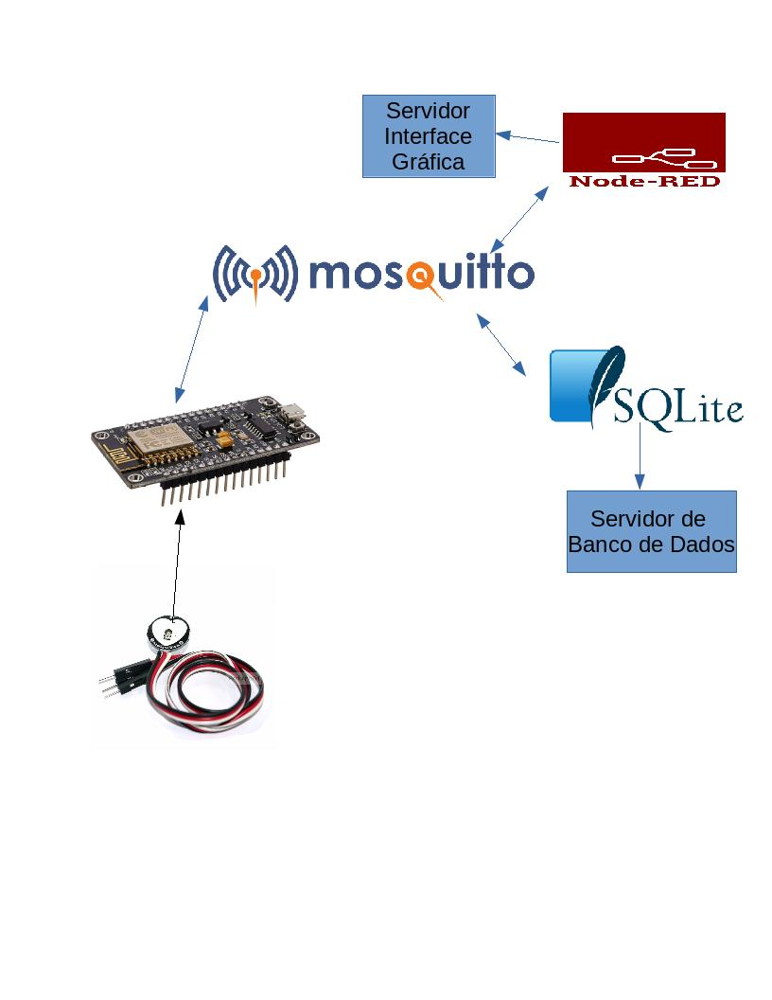

# Central de Saúde Portatil

**Integrantes:** Raphael Pontes Santana e Vitor Kenji Uema

## Objetivo do Projeto

Este projeto tem como intuito a construção de um sistema portátil de saúde para análise de dados vitais de um paciente utilizando ferramentas de IoT.
Para isso, foi utilizado um sensor de batimento cardíaco e um NodeMCU ESP8266.

## Arquitetura do projeto

A arquitetura do projeto é composta pelos seguintes nós:

## Como usar

A fim de que tenha uma perfeita utilização, você deve instalar as seguintes bibliotecas e dependências:

### Arduino

* ESP8266
* PulseSensorPlayground
* PubSubClient

### Node  

* NODEJS V8
* NODE-RED

## Referências

Para mais informações sobre sensor de batimento : www.pulsesensor.com
